# Mishka

Flutter client for **Mishka** — a study companion for students. Upload material, study with AI-generated tools, track focus sessions, keep tasks organized, and stay accountable with streaks and community groups.

Built as a production-facing iOS / Android app against a live REST API (auth, sessions, saved library, community, gamification, reports).

**Demo video:** [Watch on Google Drive](https://drive.google.com/file/d/1_895taR2NOqe8-lAwkkiopTUOPWm2cM8/view?usp=sharing)

---

## What’s in the app

**Study with AI**
- Chat with Mishka over uploaded PDFs
- Generate quizzes, flashcards, summaries, and mind maps
- Save results into a personal library and reopen them later

**Study sessions**
- Pomodoro / custom timers
- “Call with Mishka” camera mode with on-device posture monitoring (WebSocket ML service)
- Session lifecycle wired to the backend (start, pause, advance phase, end, check-ins)

**Daily habits**
- To-do lists and calendar-backed tasks
- Daily streak + freezes
- Gamification hub (weekly progress, monthly section views, badge collect)

**Community**
- Discover / create groups, roles, chat, shared study material
- Education profile used for matching (school tracks including primary, university years)

**Account & settings**
- Auth (email/password, OTP, reset flow)
- Profile + education onboarding
- Preferences: language (English / Arabic), theme, notifications, report email

---

## Stack

| Area | Choice |
|------|--------|
| Framework | Flutter (Dart 3.9+) |
| State | `flutter_bloc` (auth and selected flows), local controllers where simpler |
| Networking | Dio + typed API layer (`ApiService`, feature repositories / remote data sources) |
| Storage | `shared_preferences` (token, prefs, light caches) |
| Camera / ML | `camera`, `web_socket_channel` for posture monitor |
| UI | ScreenUtil, custom theme, Iconify |
| i18n | Official Flutter gen-l10n (`en` / `ar`) |

Architecture is feature-first under `lib/features/`, with shared networking and widgets in `lib/core/`.

```
lib/
  core/          # network, theme, prefs, shared widgets
  features/      # auth, home, chat, study, community, gamification, …
  l10n/          # generated localizations
  main.dart
```

---

## Backend

Default API host is set in `lib/core/network/api_endpoints.dart` and can be overridden at build time:

```bash
flutter run --dart-define=API_BASE_URL=https://your-api.example.com
```

AI model / study-monitor hosts live in `lib/core/network/mishka_ai_model_urls.dart` (`AI_BASE_URL` override supported).

This repo is the **mobile client only**. Backend and ML services are separate deployments.

---

## Run locally

**Requirements**
- Flutter SDK (stable, matching `sdk: ^3.9.2` in `pubspec.yaml`)
- Xcode (iOS) and/or Android Studio / SDK
- A device or simulator

```bash
git clone https://github.com/Mishka-Study-Partner/mishka-app.git
cd mishka-app
flutter pub get
flutter gen-l10n
flutter run
```

Useful variants:

```bash
# Physical iPhone
flutter devices
flutter run -d <device_id>

# Point at another API
flutter run --dart-define=API_BASE_URL=https://...
```

For iOS signing, open `ios/Runner.xcworkspace` in Xcode and set your team if needed.

---

## Project notes

- Localization sources: `lib/l10n/app_en.arb`, `lib/l10n/app_ar.arb`
- Feature handoff / API notes live under `docs/` (integration references, not required to run the app)
- Deep links for community invites exist in code but are currently disabled in the client entitlements / launch path

---

## Screenshots

<p align="center">
  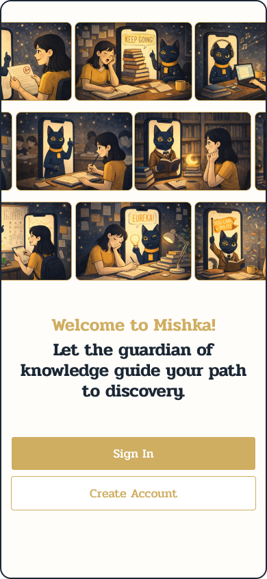
  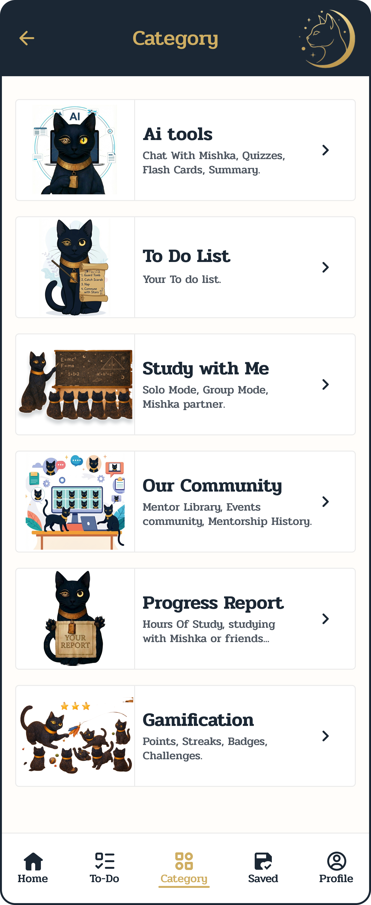
  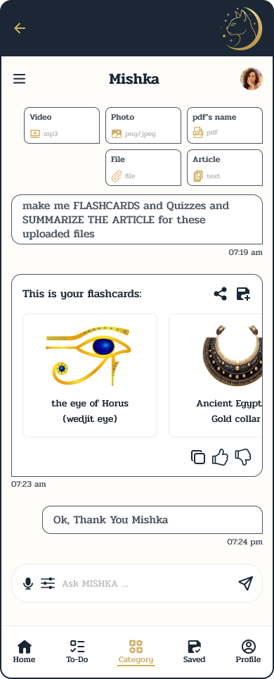
  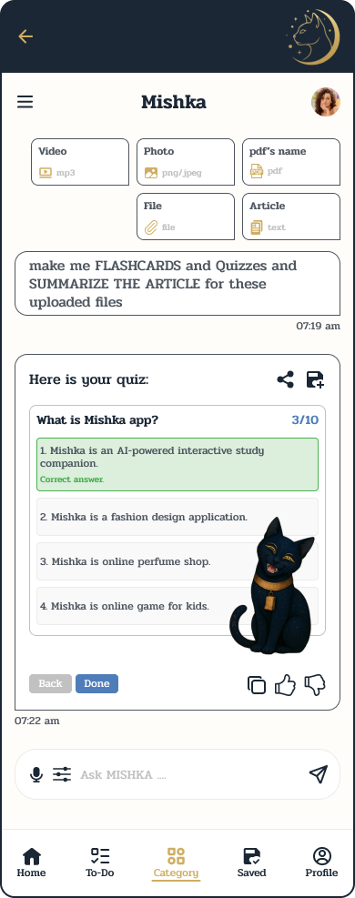
</p>

<p align="center">
  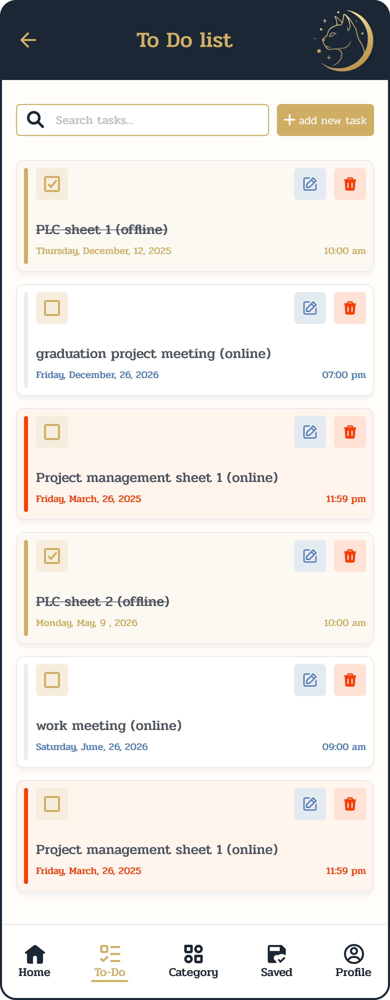
  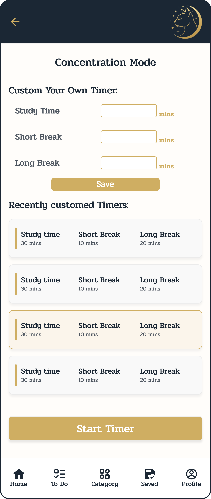
  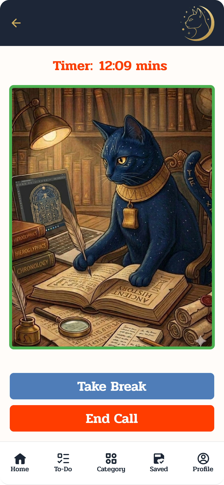
  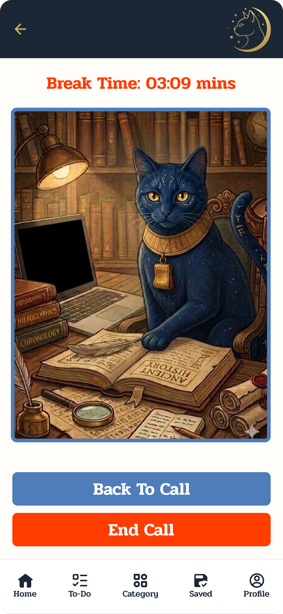
</p>

<p align="center">
  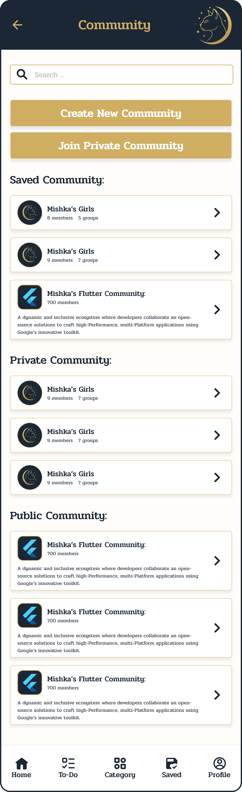
  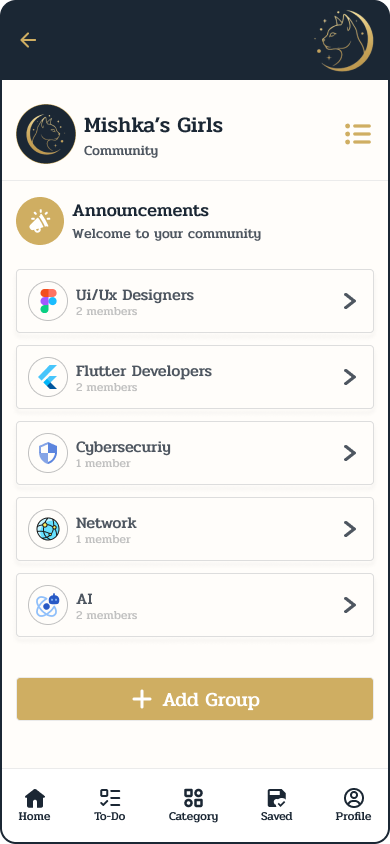
  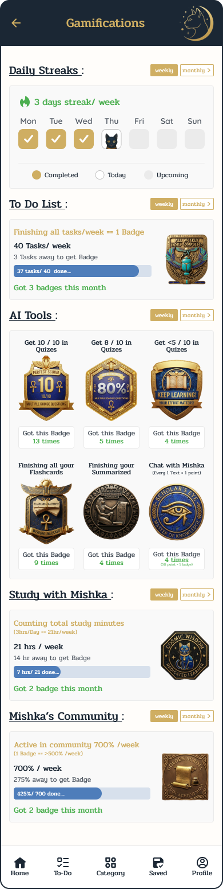
  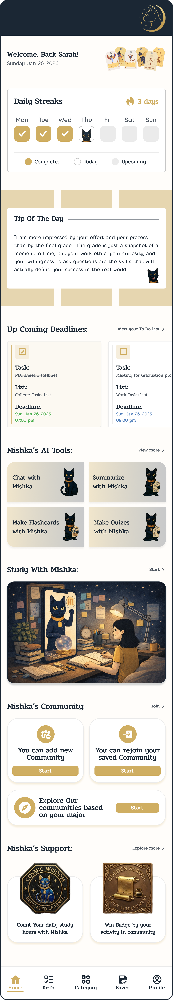
</p>

Full walkthrough: [demo video (Google Drive)](https://drive.google.com/file/d/1_895taR2NOqe8-lAwkkiopTUOPWm2cM8/view?usp=sharing)

---

## Author

**Norhan Mohamed** — Flutter client for Mishka Study Partner.

- GitHub: [Norhan-Mohamed](https://github.com/Norhan-Mohamed)
- Repository: [Mishka-Study-Partner/mishka-app](https://github.com/Mishka-Study-Partner/mishka-app)
